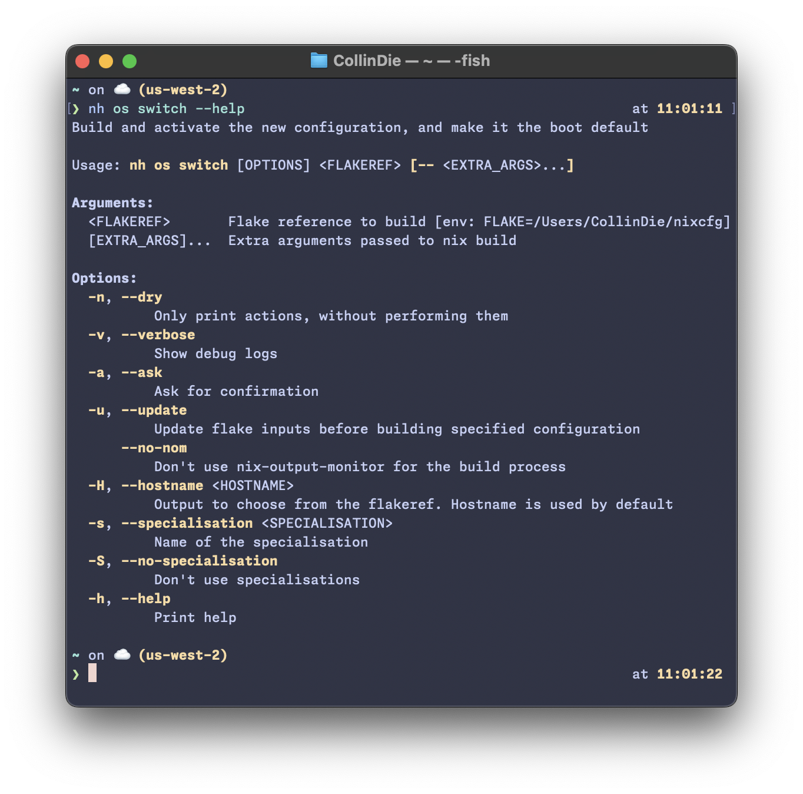

[](https://deps.rs/repo/github/ToyVo/nh_darwin)

<h1 align="center">nh_darwin</h1>

<h6 align="center">Because the name "yet-another-<u>n</u>ix-<u>h</u>elper" was too long to type...</h1>
Works on NixOS, NixDarwin, and HomeManager Standalone

## Why fork?

The original owner is unwilling to pull in changes to support darwin because they don't have a mac to be able to
maintain support https://github.com/viperML/nh/issues/67 & https://github.com/viperML/nh/pull/97

## What has been added?

-   `nh os switch` works on nix-darwin
-   nixDarwinModules.default is similar to the nixosModule for nix.gc and programs.nh.clean
-   Use this fork of nh in nixDarwinModules.default and nixosModules.default
-   When $FLAKE isn't defined, default to `/etc/nixos`
-   `nh os switch --update` works when the flake is at `/etc/nixos` or in a root owned directory

## What does it do?

NH reimplements some basic nix commands. Adding functionality on top of the existing solutions, like nixos-rebuild,
home-manager cli or nix itself.

As the main features:

-   Tree of builds with [nix-output-monitor](https://github.com/maralorn/nix-output-monitor)
-   Visualization of the upgrade diff with [nvd](https://gitlab.com/khumba/nvd)
-   Asking for confirmation before performing activation

<p align="center">
  
</p>

## Installation

### NixDarwin Module

This fork defines a nixDarwin module inspired by the nixosModule and the nixDarwin nix gc module

This PR adds a nixDarwin module to nixDarwin itself https://github.com/LnL7/nix-darwin/pull/942
and once that is pulled in and before I update my nixDarwin module, they will conflict, in which case you
can manually override `programs.nh.package = inputs.nh_darwin.packages.${pkgs.stdenv.hostPlatform.system}.default;`

Once that PR is pulled in I will update my nixDarwin module similarily to the nixos module in which case
will then be able to choose between importing the module from this repo or just overriding the package

<details>
<summary>Example NixDarwin Flake</summary>
<br>

```nix
{
  description = "Example Darwin system flake";

  inputs = {
    nixpkgs.url = "github:NixOS/nixpkgs/nixpkgs-unstable";
    nix-darwin.url = "github:LnL7/nix-darwin";
    nix-darwin.inputs.nixpkgs.follows = "nixpkgs";
    nh_darwin.url = "github:ToyVo/nh_darwin";
  };

  outputs = inputs@{ self, nix-darwin, nixpkgs, nh_darwin }:
  let
    configuration = { pkgs, ... }: {
      # List packages installed in system profile. To search by name, run:
      # $ nix-env -qaP | grep wget
      environment.systemPackages =
        [ pkgs.vim
          # Always an option
          # nh_darwin.packages.${pkgs.stdenv.hostPlatform.system}.default;
        ];

      programs.nh = {
        enable = true;
        clean.enable = true;
        # Installation option once https://github.com/LnL7/nix-darwin/pull/942 is merged:
        # package = nh_darwin.packages.${pkgs.stdenv.hostPlatform.system}.default;
      };

      # Auto upgrade nix package and the daemon service.
      services.nix-daemon.enable = true;
      # nix.package = pkgs.nix;

      # Necessary for using flakes on this system.
      nix.settings.experimental-features = "nix-command flakes";

      # Create /etc/zshrc that loads the nix-darwin environment.
      programs.zsh.enable = true;  # default shell on catalina
      # programs.fish.enable = true;

      # Set Git commit hash for darwin-version.
      system.configurationRevision = self.rev or self.dirtyRev or null;

      # Used for backwards compatibility, please read the changelog before changing.
      # $ darwin-rebuild changelog
      system.stateVersion = 4;

      # The platform the configuration will be used on.
      nixpkgs.hostPlatform = "x86_64-darwin";
    };
  in
  {
    # Build darwin flake using:
    # $ darwin-rebuild build --flake .#simple
    darwinConfigurations."simple" = nix-darwin.lib.darwinSystem {
      modules = [
        configuration
        # Primary installation option:
        nh_darwin.nixDarwinModules.default
      ];
    };

    # Expose the package set, including overlays, for convenience.
    darwinPackages = self.darwinConfigurations."simple".pkgs;
  };
}
```

</details>

### NixOS module

This fork has a nixos module that simply sets programs.nh.package to this fork

The NixOS module has some niceties, like an alternative to `nix.gc.automatic` which also cleans XDG profiles, result and
direnv GC roots.

```nix
{ config, pkgs, ... }:
{
  programs.nh = {
    enable = true;
    clean.enable = true;
    clean.extraArgs = "--keep-since 4d --keep 3";
    flake = "/home/user/my-nixos-config";
  };
}
```

### FLAKE environment variable

nh uses the `FLAKE` environment variable as the default flake to use for its operations. This can be configured by
whichever method you want,
or use the `programs.nh.flake` NixOS option.

### Specialisations support

nh is capable of detecting which specialisation you are running, so it runs the proper activation script.
To do so, you need to give nh some information of the spec that is currently running by writing its name to
`/etc/specialisation`. The config would look like this:

```nix
{config, pkgs, ...}: {
  specialisation."foo".configuration = {
    environment.etc."specialisation".text = "foo";
    # ..rest of config
  };

  specialisation."bar".configuration = {
    environment.etc."specialisation".text = "bar";
    # ..rest of config
  };
}
```

## Hacking

Just `nix develop`. We also provide an `.envrc` for direnv.
